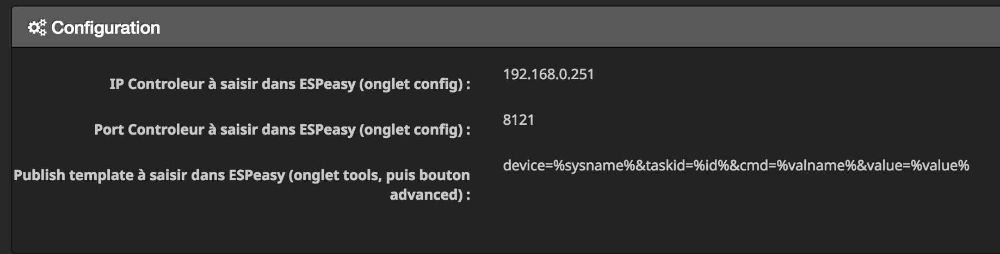
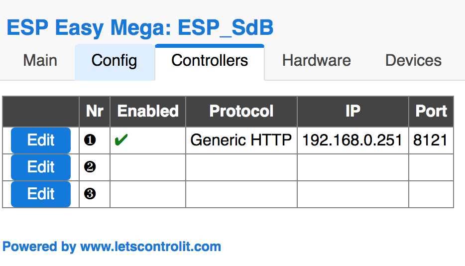
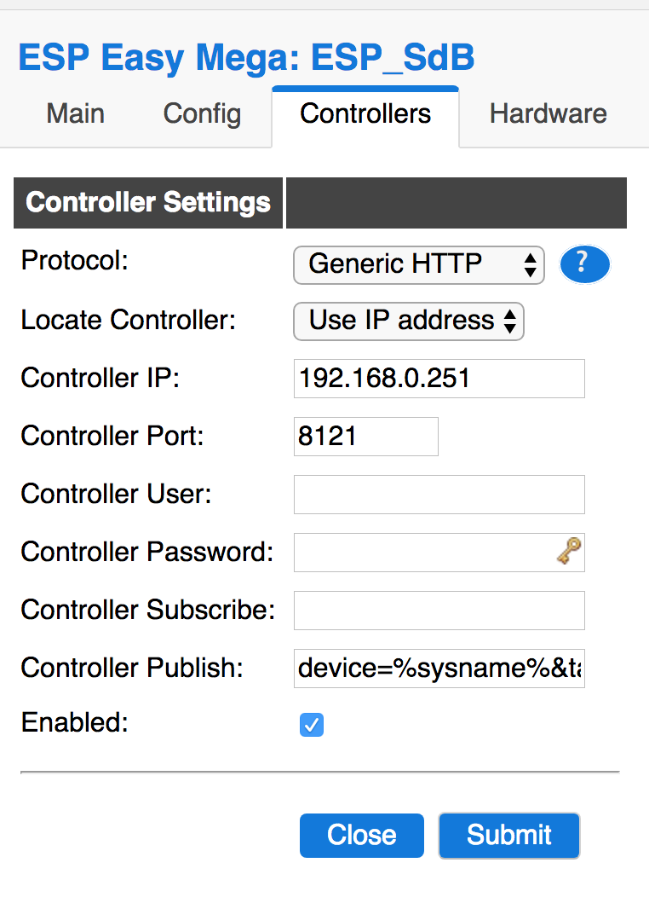
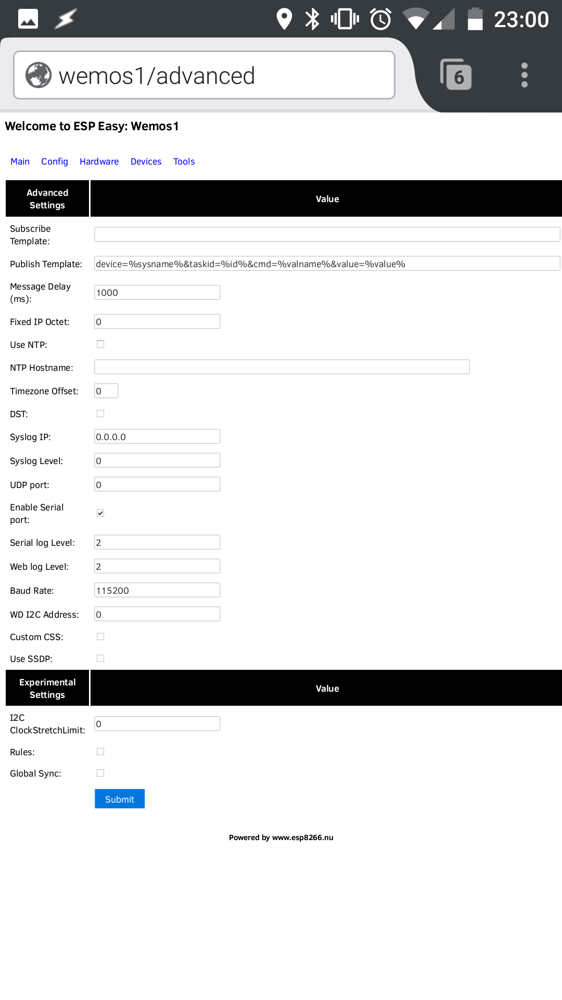
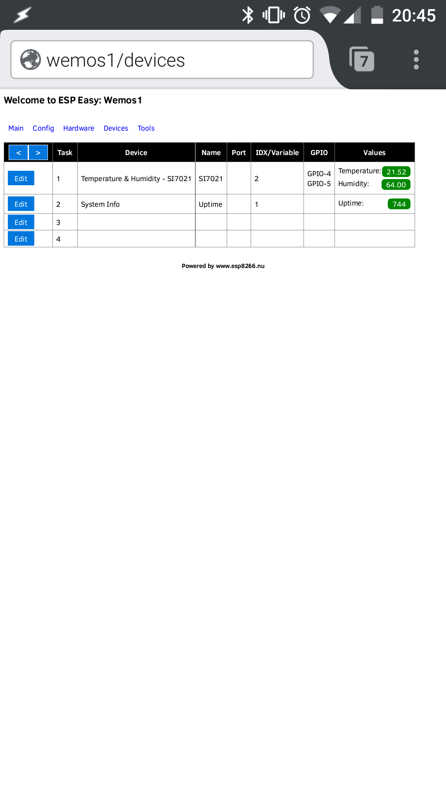

# Description

## ESPeasy, firmware polyvalent pour les ESP8266

ESPeasy est un firmware pour les différents types d’ESP8266.

Une fois chargé, vous disposez d’une page web d’administration qui
permet de configurer les capteurs/actionneurs de l’ESP en live et aussi
son interaction avec un logiciel de domotique

## Que fait le plugin Jeedom pour ESPeasy

Le plugin facilite l’utilisation d’ESPeasy avec Jeedom.

Il n’est pas nécessaire dans le principe, puisque par exemple ESPeasy
fonctionne en MQTT.

En revanche, il offre une URL unique à renseigner pour tous les ESP8266
et la création des équipements à la volée avec leurs capteurs. Les
actionneurs sont ajoutés en saisissant juste leur ID et valeur.

## Références ESPeasy

Site ESPeasy : [https://www.letscontrolit.com/wiki/index.php/ESPEasy](https://www.letscontrolit.com/wiki/index.php/ESPEasy)

# Configuration du plugin

## installation du plugin 

Après installation et activation du plugin, l'installation des dépendances se lance.

Le démon lancé, la page du plugin indique les 3 informations à renseigner dans vos modules ESPeasy, il n’y a pas de configuration à faire pour les capteurs.

## configuration du module

**Il faut éditer la page controllers :**

**Editer les valeurs avec celles fournies par le plugin :**

---

Sur un équipement existant, vous pourrez rajouter les actionneurs

L’adresse du controlleur et le port sont à renseigner sur l’onglet
"config"

Pour le publish template, il faut aller dans l’onglet "tools"

Là on clique sur le bouton "advanced" et on remplit le champ "publish
template"

Il semble nécessaire également que les capteurs aient un device
renseigné, même si pour Jeedom il ne sert à rien, donc si rien ne
remonte, n’oubliez pas de le saisir dans l’onglet "device"

# FAQ

Est-ce que le plugin utilise le Cloud ?

> Non, les communications se font via HTTP directement des ESP à Jeedom

# Troubleshoting

Comment se créer mes équipements?

> A l’envoi d’informations par l’ESP

Vos ESPeasy ne remontent pas dans le plugin

> Vérifier que la configuration réseau interne de votre Jeedom est bien configurée avec une adresse IP et non DNS.
